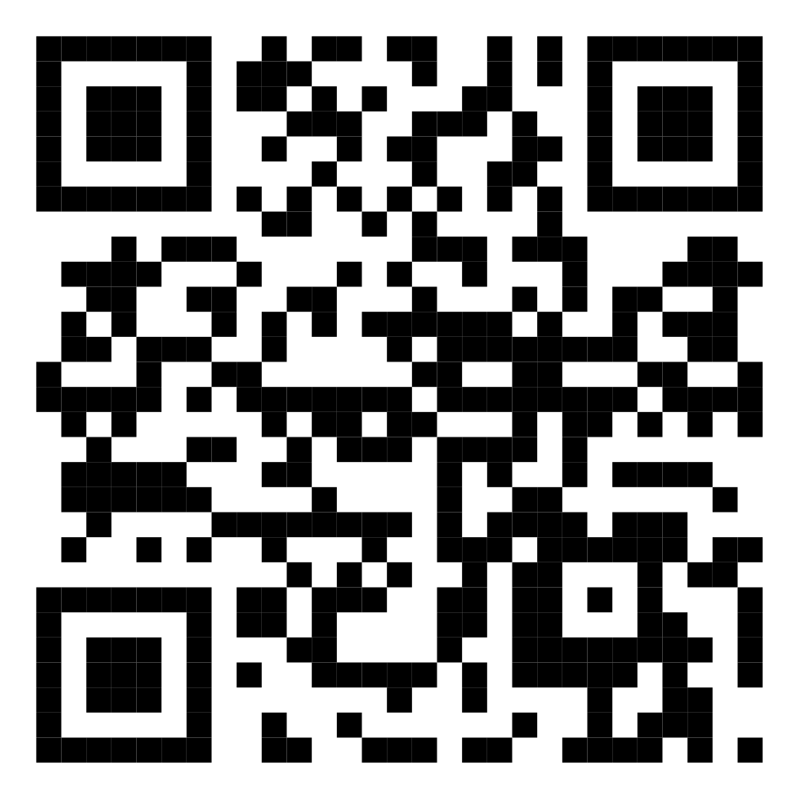

## LaTeX Introduction

https://github.com/jeremyworsfold/LaTeX-Tutorial

---

## Other resources

[Overleaf LaTeX introduction](https://www.overleaf.com/learn/latex/Learn_LaTeX_in_30_minutes)

[Tutorial/reference for RevTeX documentclass](https://www.overleaf.com/latex/templates/revtex-4-dot-2-template-and-sample/yydsrzvrqrzs)

---

## A minimal working example

- Paragraphs
- Equations
- Figures

---

## Get familiar with Overleaf

Makes starting out a lot easier (easier to see and correct errors)

Use toolbar or tab complete for:
- figures
- symbols
- tables

---

## Columns and margins

---

## Document classes

Always start by declaring what document class you are using.
- `article`: Standard and default
- `revtex4-2`: version 4.2 of RevTex used by the American Physics Society (APS) journals and others. Probably the best for lab reports in two columns and might be exactly the style your lecturers are used to and want you to produce
- `book`: longer format with `\chapter{}` defined
- `memoir`: similarly long format, higher learning curve but nice aesthetics

---

## Citations

I recommend using `natbib`

Make sure you set the `\bibliographystyle{}`, then have `\bibliography{name}` at the end, generally before any appendices

Reference managers can help with `.bib` files but always check them

**Tip: wrapping text with {} brackets ensures words stay capitalized**

---

### Packages

- **`physics`:** Useful for mathematics typesetting, e.g. integrals and partial derivatives
- **`cleveref`**: Automatic addition of "Section", "Appendix", "eq." etc
- **`microtype`**: Adjusts spacing of characters slightly to avoid awkward line breaks
- **`mathtools`**: for more niche symbols
- **`titlesec`**: adjust section formatting
- [**`listings`:**](https://www.overleaf.com/learn/latex/Code_listing) Enter code snippets as text or load from a file

